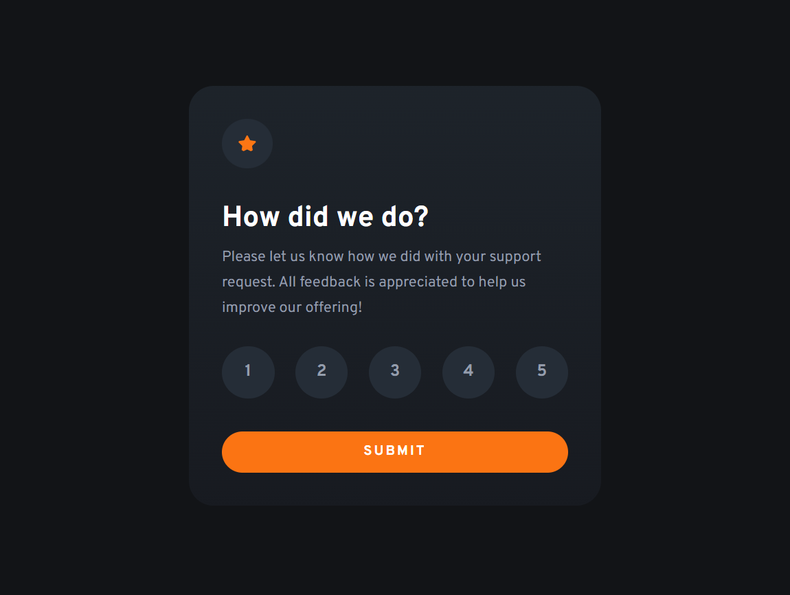

# Frontend Mentor - Interactive rating component solution

This is a solution to the [Interactive rating component challenge on Frontend Mentor](https://www.frontendmentor.io/challenges/interactive-rating-component-koxpeBUmI). Frontend Mentor challenges help you improve your coding skills by building realistic projects. 

## Table of contents

- [Overview](#overview)
  - [The challenge](#the-challenge)
  - [Screenshot](#screenshot)
  - [Links](#links)
- [My process](#my-process)
  - [Built with](#built-with)
  - [What I learned](#what-i-learned)
  - [Continued development](#continued-development)
  - [Useful resources](#useful-resources)
- [Author](#author)

## Overview

### The challenge

Users should be able to:

- View the optimal layout for the app depending on their device's screen size
- See hover states for all interactive elements on the page
- Select and submit a number rating
- See the "Thank you" card state after submitting a rating

### Screenshot

### Links

- [Solution URL](https://github.com/Nospiel-code/fm-rating-component)
- [Live Site URL](https://nospiel-code.github.io/fm-rating-component/)

## My process

### Built with

- Semantic HTML5 markup
- CSS custom properties
- Flexbox
- CSS Grid
- JavaScript
- HTML Forms

### What I learned

When the input is inside a label it is not necessary to use the *for=""*.

There are two **button types** submit and reset, if no type is set submit is the default setting.

Every page needs an **h1**, in this case because we switch to another card we have two h1 because there is always just one visible.

There is a **template HTML element** which is not rendered immediately when a page is loaded but may be instantiated subsequently during runtime using JavaScript.

### Continued development

I will use what I learn about JavaScript in the next challenges.

### Useful resources

- [YouTube Walkthrough](https://www.youtube.com/watch?v=j12yejW6v1M&ab_channel=AndreasRemdt) - This helped me to implement JavaScript and do the CSS styling for the radio buttons.

## Author

- Frontend Mentor - [@Nospiel-code](https://www.frontendmentor.io/profile/Nospiel-code)
- Twitter - [@tomsdev4](https://www.twitter.com/tomsdev4)

